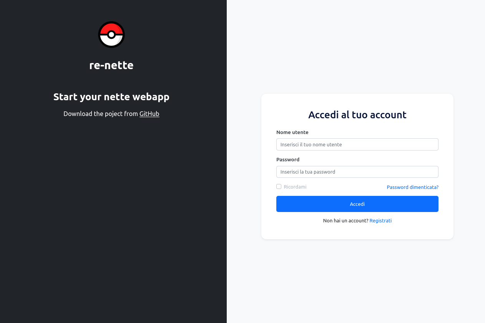

# re-Nette 

**re-Nette** is a starter template for PHP applications built using the [Nette Framework](https://nette.org/).  
It provides a clean, minimal structure to get up and running quickly with authentication, user registration, and a basic presenter layout.

---

## 🚀 Features

- Minimal and clean Nette Framework setup
- User registration and login functionality
- Database support via Nette Database Explorer
- Password hashing with `Nette\Security\Passwords`
- Flash messaging system
- Session support and route protection

---

## ⚙️ Setup Instructions

### 1. Clone the repository
```bash
git clone https://github.com/AEdral/re-Nette.git
cd re-Nette
```

### 2. Run setup script (Linux/macOS)
- If you're on Linux or macOS, run the setup script to automate configuration:

```bash
./setup-nette-project.sh
```

## 🛠 Manual Setup (All OS)

### 1. Install dependencies
- Make sure Composer is installed, then run:

```bash
composer install
```

### 2. Configure environment
- Copy the local configuration and customize it:

```bash
cp app/config/local.neon.example app/config/local.neon
```

- Edit app/config/local.neon with your database and mail settings.

### 3. Set up the database
- Ensure your database is running. You can import any provided SQL schema manually.

### 4. Start the development server
``` bash
php -S localhost:8000 -t www
```
- Visit http://localhost:8000 in your browser.

## 🖥️ Supported Operating Systems
This project works on:

- ✅ Linux (tested on Ubuntu/Debian)

- ✅ macOS

- ✅ Windows (manual setup required using tools like XAMPP or Laragon)

Requires PHP 8.1+ and Composer.


